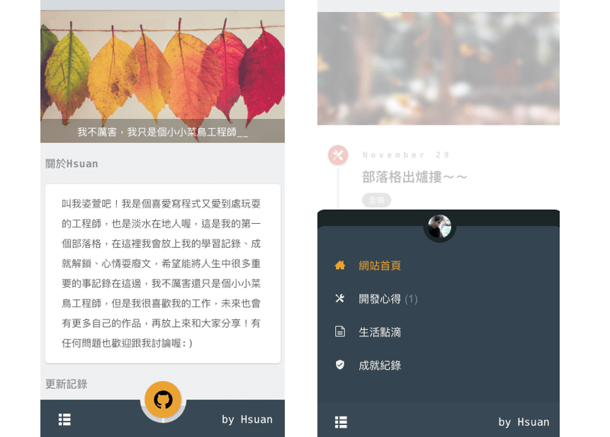

# 這是我的第一個部落格
+ 說明：此專案包含前台頁面及後台上稿
+ 前端
  + 切版：SCSS (含 RWD)
  + Gulp：程式碼自動化打包壓縮，以及 LiveReload 可以偵側當程式碼更動時自動 refresh
  + JavaScript, jQuery
+ 後端
  + PHP MVC 框架： Maple (來源：https://github.com/comdan66/Maple)
  + 資料庫：Mysql (使用 ORM - Active Record)
  + server：AWS EC2
  
+ DEMO： https://blog.kerker.tw/ 
+ 圖示：

